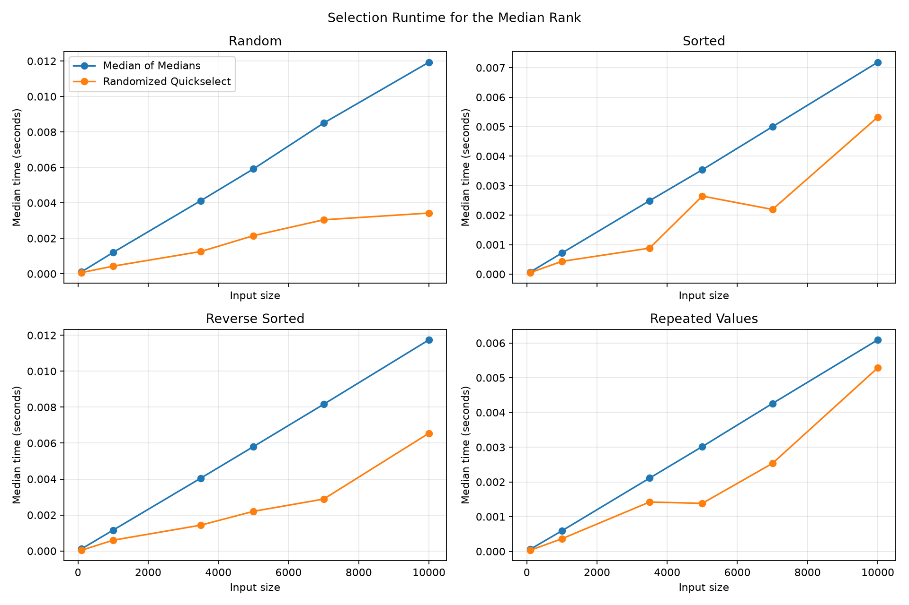
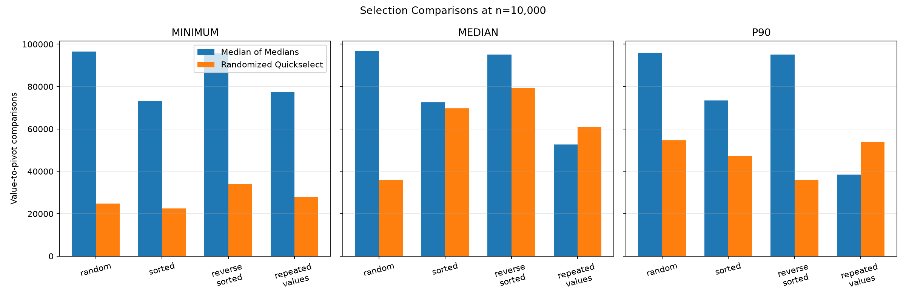
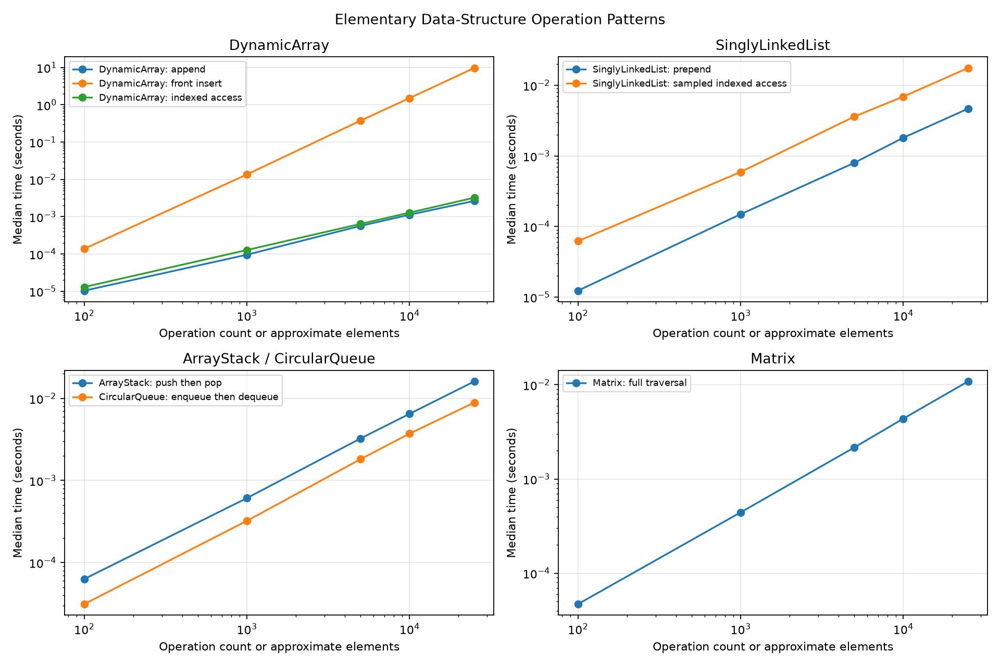

# 1. Title and Student/Course Details

**Assignment:** Assignment 6 - Medians and Order Statistics & Elementary Data Structures

**Student:** Ashish Mahajan

**Course:** MSCS 532-B01 - Algorithms and Data Structures

**Instructor:** Dr. Michael Solomon

## 2. Introduction

Order-statistic selection finds the value that would occupy a requested rank without paying the full `Theta(n log n)` cost of sorting every value. Elementary data structures solve a related design problem: they organize values so that operations such as access, insertion, removal, and traversal have predictable costs. This project implements both topics directly in Python and evaluates their observed behavior.

## 3. Assignment Objectives

The work has four objectives: implement deterministic and randomized kth selection; explain their correctness, time, and space costs; implement arrays, matrices, stacks, queues, and singly linked lists from scratch; and connect theoretical costs to reproducible empirical measurements and generic cloud-operations applications.

## 4. Order Statistics and kth Selection

The kth order statistic is the kth smallest value. The public API uses one-based ranks: `k=1` requests the minimum and `k=n` requests the maximum. For an even list such as `[1, 2, 3, 4]`, `k=2` returns 2 and `k=3` returns 3. This differs from a statistical median that may average the two central values.

Both implementations reject empty inputs, ranks outside `1..n`, Boolean values, and unsupported types. Copy mode preserves the caller's input; in-place mode may rearrange it. Neither algorithm fully sorts the complete input.

## 5. Deterministic Median of Medians Design

Median of Medians divides the active range into groups of at most five. A manual insertion sort orders each small group, and the central value becomes that group's median. The algorithm recursively selects the median of these medians, partitions the active range into values below, equal to, and above that pivot, and continues only in the region containing the target rank. This design follows the deterministic linear-selection result of Blum et al. (1973).

## 6. Why Median of Medians Is Worst-Case Theta(n)

At least half of the group medians are at or above the median of medians. Except for a possible incomplete group and the pivot group, each of those groups contributes at least three values at or above the pivot. A symmetric argument applies below the pivot. Therefore, after partitioning, the larger continuing side contains at most about `7n/10` values.

The conceptual recurrence is

`T(n) <= T(ceil(n/5)) + T(7n/10 + c) + O(n)`.

The first recursive term selects the pivot from group medians; the second selects in the only remaining candidate region; and the linear term covers grouping, small-group work, and partitioning. The recursive fractions sum to `1/5 + 7/10 = 9/10`, which is less than one. Substitution therefore bounds the total geometric work by `O(n)`. General selection must inspect enough input to distinguish the requested order statistic, giving `Omega(n)`. The deterministic worst-case time is consequently `Theta(n)` (Blum et al., 1973; Cormen et al., 2022).

## 7. Randomized Quickselect Design

Randomized Quickselect chooses an index uniformly from the active range using a local `random.Random(seed)` instance. Its pivot value is passed to the shared three-way partition, and an iterative loop keeps only the target-containing region. A fixed seed reproduces pivot choices and metrics without modifying module-global random state. The approach derives from selection by partitioning, as introduced by Hoare (1961).

## 8. Why Randomized Quickselect Is Expected Theta(n)

Partitioning an active range of size `n` costs `Theta(n)`. A uniformly random pivot can be poor in an individual run, but the expected remaining subproblem is a constant fraction `alpha n`, where expected `alpha < 1`. The work therefore follows

`E[T(n)] <= E[T(alpha n)] + Theta(n)`.

Expanding produces `n + alpha n + alpha^2 n + ...`, a convergent geometric series with sum `Theta(n)`. Randomized Quickselect has expected `Theta(n)` time, but an unlucky sequence of extreme pivots can produce `Theta(n^2)` work. Randomization reduces dependence on original input order; it does not remove the mathematical worst case (Cormen et al., 2022).

## 9. Selection Correctness and Duplicate Handling

The shared Dutch National Flag partition returns the first and last indexes of the pivot-equal region. Values before that region are strictly smaller, values within it equal the pivot, and values after it are strictly larger. If the target falls in the equal region, selection returns immediately. This preserves rank correctness and prevents duplicate pivot values from being processed one at a time. Tests also verify that partitioning modifies only the active subarray.

## 10. Selection Space Complexity

The three-way partition itself uses `O(1)` auxiliary space. Randomized Quickselect uses an iterative active-range loop, so its in-place algorithmic auxiliary space is `O(1)`; default copy mode adds `O(n)`.

This Median-of-Medians implementation collects group medians in temporary lists. Across nested pivot-selection calls, those lists form a decreasing geometric sequence and require `O(n)` auxiliary space in the worst case. Its recursive depth is logarithmic. Default copy mode also adds `O(n)`, so it would be inaccurate to claim constant total space.

## 11. Selection Benchmark Methodology

The benchmark used input sizes 100, 1,000, 3,500, 5,000, 7,000, and 10,000. It evaluated random, sorted, reverse-sorted, and repeated-value datasets at the minimum, median, and p90 ranks. Every combination received one untimed warm-up and five timed trials measured with `time.perf_counter()`. Dataset and pivot seeds were deterministic, every run received independent working data, and correctness was verified outside the timed interval against `sorted(dataset)[k - 1]`.

The design produced `2 x 4 x 6 x 3 = 144` rows. All 144 combinations completed without a correctness failure. Median time is emphasized because it is less sensitive than a single trial to short transient disturbances. No statistical significance test was performed.

## 12. Empirical Selection Results

The table reports the measured median time and recorded value-to-pivot comparisons at `n=10,000`.

| Distribution | Rank | Median of Medians (ms) | Randomized (ms) | MoM comparisons | Randomized comparisons |
|---|---|---:|---:|---:|---:|
| Random | Minimum | 12.258 | 2.444 | 96,526 | 24,763 |
| Random | Median | 11.935 | 3.427 | 96,701 | 35,750 |
| Random | P90 | 12.010 | 4.760 | 96,048 | 54,614 |
| Sorted | Minimum | 7.381 | 2.016 | 73,162 | 22,537 |
| Sorted | Median | 7.187 | 5.327 | 72,586 | 69,724 |
| Sorted | P90 | 7.306 | 3.797 | 73,511 | 47,257 |
| Reverse sorted | Minimum | 11.751 | 3.126 | 95,625 | 34,058 |
| Reverse sorted | Median | 11.742 | 6.549 | 95,059 | 79,236 |
| Reverse sorted | P90 | 11.454 | 3.172 | 95,183 | 35,820 |
| Repeated values | Minimum | 8.531 | 2.643 | 77,473 | 28,000 |
| Repeated values | Median | 6.091 | 5.286 | 52,594 | 61,000 |
| Repeated values | P90 | 4.244 | 4.169 | 38,509 | 54,000 |

## 13. Theory Versus Observed Selection Results

In this benchmark, Median of Medians grew approximately linearly and did not degrade on sorted or reverse-sorted input. The group construction and manual small-group sorts introduced larger constants, so seeded Randomized Quickselect had lower measured time in every `n=10,000` case. That observation is consistent with Quickselect's practical average-case appeal but does not give it a deterministic guarantee.

The repeated-value cases demonstrate the effect of three-way partitioning. At `n=10,000`, randomized selection required only 4, 6, and 6 partitions for the minimum, median, and p90 ranks. Median of Medians required 29, 13, and 18 partitions. Equal regions eliminated many candidates at once, although small-group sorting still contributed to deterministic comparison counts.

## 14. DynamicArray Design and Complexity

`DynamicArray` uses a Python list only as fixed-capacity backing storage. It doubles capacity when full and halves capacity only when usage falls to one quarter, never below the initial capacity. Indexed access and replacement are `O(1)`; append is `O(1)` amortized; resize, arbitrary insertion, and arbitrary deletion are `O(n)`; and search is `O(n)`. Unused capacity trades some memory for fewer allocations.

## 15. Matrix Design and Complexity

`Matrix` stores rectangular rows as nested `DynamicArray` instances. Cell access and replacement are `O(1)`. Row insertion and deletion require row-reference shifts plus row-width work, giving `O(rows + columns)` in this implementation. Column insertion or deletion can shift every row and is `O(rows x columns)` in the worst case. A full traversal is `O(rows x columns)`. Validation prevents ragged shapes and retains at least one row and column.

## 16. ArrayStack Design and Complexity

`ArrayStack` stores the stack top at the end of a `DynamicArray`. Push and pop are `O(1)` amortized, peek is `O(1)`, and size and emptiness checks are `O(1)`. A resize can take `O(n)` for an individual operation. The structure does not expose its backing storage for mutation.

## 17. CircularQueue Design and Complexity

`CircularQueue` tracks head, tail, size, and capacity. Enqueue writes at the tail and dequeue advances the head, so removal does not shift remaining values. Enqueue is `O(1)` amortized, dequeue and peek are `O(1)`, resizing is `O(n)`, and allocated space is `O(capacity)`. When growth occurs after wrap-around, values are copied into logical FIFO order.

## 18. SinglyLinkedList Design and Complexity

Each `Node` stores a value and one successor reference. The list retains head, tail, and size. Prepend and append are `O(1)`, including append because the tail is stored. Search and indexed access are `O(n)`. Insertion or deletion is `O(1)` after a predecessor is known, but index-based operations include `O(n)` traversal. Reversal is `O(n)` and changes links in place.

## 19. Data-Structure Empirical Experiment

The experiment used sizes 100, 1,000, 5,000, 10,000, and 25,000, with one warm-up and five measured trials. Setup that was not part of the named operation was prepared before timing, and every trial included a correctness check.

| Operation at size 25,000 | Measured median (seconds) |
|---|---:|
| DynamicArray append | 0.002647 |
| DynamicArray indexed access over all positions | 0.003227 |
| DynamicArray repeated front insertion | 9.700062 |
| SinglyLinkedList prepend | 0.004656 |
| SinglyLinkedList access at 100 sampled indexes | 0.017541 |
| ArrayStack push then pop | 0.016077 |
| CircularQueue enqueue then dequeue | 0.008894 |
| Matrix full traversal | 0.010832 |

Repeated DynamicArray front insertion was much slower because each insertion shifts the existing sequence, producing quadratic total work. Linked-list prepend remained constant per operation. DynamicArray indexed access remained constant per position, while each sampled linked-list index required traversal. The circular queue avoided the `O(n)` shift associated with naive front removal. Stack and queue timings also include occasional amortized resizing. Python object allocation and method-call overhead affect all measured constants.

These operations do not solve identical problems, so the results are operation-pattern evidence rather than a universal ranking of structures.

## 20. Arrays Versus Linked Lists

Arrays offer compact contiguous-reference storage, `O(1)` indexing, good locality, and simple traversal. Their trade-offs are geometric resizing, possible unused capacity, and `O(n)` shifts near the front. Linked lists allow `O(1)` insertion or removal at known endpoints or nodes and require no geometric resize, but they have `O(n)` indexed access, poorer locality, per-node reference overhead, and more pointer maintenance.

For stacks, both arrays and linked lists can provide `O(1)` endpoint operations, while an array-backed stack is often simpler and locality-friendly. For queues, naive array front removal is `O(n)`, but a circular array provides `O(1)` dequeue without shifting. A linked queue with head and tail references also supports `O(1)` endpoint operations. Workload, memory predictability, and access patterns determine the better representation.

## 21. Cloud-Native and Practical Applications

Selection can identify a median deployment duration, a p90 or p95 latency threshold, a kth-largest cost after rank conversion, or an anomaly-review cutoff without sorting every record. Dynamic arrays suit indexed resource inventories and append-heavy observations. Matrices represent environment-by-region capacity, service-by-metric observations, cost tables, or compliance scores.

Stacks naturally represent rollback actions, undo history, expression parsing, and depth-first traversal. Queues model CI/CD job intake, incident processing, breadth-first traversal, reconciliation work, and event buffering. Linked lists can model mutable workflow steps or cleanup chains where insertion and removal through known node references matter more than indexed access. All examples in this project are generic and synthetic; no deployment or cloud API is contacted.

## 22. Design Trade-offs

Median of Medians pays additional constant overhead to guarantee bounded pivot quality. Randomized Quickselect is simpler and was faster here, but it offers an expected rather than worst-case linear bound. Three-way partitioning improves duplicate handling for both.

Likewise, no data structure is best for every workload. Arrays favor indexing and locality; linked lists favor known-node changes; stacks encode reverse completion order; circular queues encode arrival order; and matrices make two-dimensional relationships explicit.

## 23. Limitations

The benchmarks were run on one machine under one Python runtime, and no statistical significance test was performed. Timings should not be generalized as universal performance rankings. Instrumentation and Python object overhead affect constants. Selection accepts only `list[int]`, the Matrix retains positive dimensions, and Randomized Quickselect retains a `Theta(n^2)` worst case. The data-structure experiment intentionally compares distinct operation patterns rather than interchangeable tasks.

## 24. Conclusion

The implementation demonstrates that kth selection can be linear without fully sorting the input. Median of Medians provides worst-case `Theta(n)` through guaranteed pivot quality, while Randomized Quickselect provides expected `Theta(n)` with smaller measured constants in this experiment. Three-way partitioning makes both correct and efficient on duplicates. The data-structure implementations and measurements further show that performance follows operation requirements: indexing favors arrays, endpoint insertion can favor linked structures, and circular indexing prevents queue front shifts.

## 25. References

Blum, M., Floyd, R. W., Pratt, V. R., Rivest, R. L., & Tarjan, R. E. (1973). Time bounds for selection. *Journal of Computer and System Sciences, 7*(4), 448-461. https://doi.org/10.1016/S0022-0000(73)80033-9

Cormen, T. H., Leiserson, C. E., Rivest, R. L., & Stein, C. (2022). *Introduction to algorithms* (4th ed.). MIT Press.

Hoare, C. A. R. (1961). Algorithm 65: FIND. *Communications of the ACM, 4*(7), 321-322. https://doi.org/10.1145/366622.366647

Python Software Foundation. (n.d.). *random — Generate pseudo-random numbers*. https://docs.python.org/3/library/random.html

Python Software Foundation. (n.d.). *time — Time access and conversions*. https://docs.python.org/3/library/time.html#time.perf_counter

## 26. GitHub Repository

[https://github.com/AshishM26/MSCS532_Assignment_6_AM](https://github.com/AshishM26/MSCS532_Assignment_6_AM)
